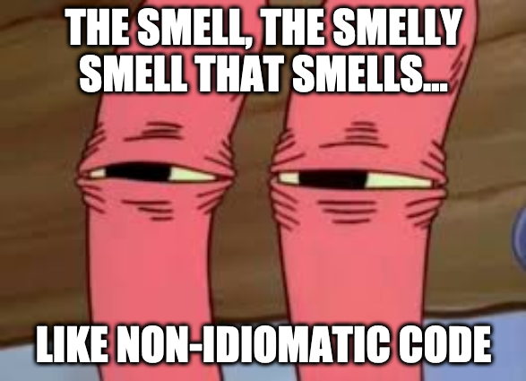

# ClojureFame - Week 2 - Day 6

After spending a few hours baling hay yesterday, I woke up fairly exhausted today. My only real expectation for today was to rest and maybe do some light reading on Clojure related topics. So this post is going to be the lightest post so far.

## What I learned today

I finished chapter 3 yesterday and I worked through the problems today. The differences in approach between Clojure from the Ground Up and Brave Clojure were very evident by how quickly Brave Clojure exposes you to concepts like `loop` and `recur`. But Brave Clojure does it in a way that's light-hearted and well put so the reader does not feel overwhelmed. I think I'm going to have fun with the rest of Brave Clojure.

I started chapter 4 which is about the core functions of Clojure. One cool concept I read was Clojure's _programming to abstractions_. This is relevant to developing a good understanding of Clojure sequences and what makes them powerful. In Clojure from the Ground Up, we're exposed to the API of sequences and how lazy evaluation allows us to chain many operations on sequences together in an incredibly powerful way.

We can think of Clojure _abstractions_ as a named collection of operations. As long as you can perform all of an _abstractions_ on an object, the object is a de-facto instance of the abstraction.

A good example are the `map` and `reduce` functions. We've seen these functions being used with different types of data structures and objects, but the fundamental API for them remains the same.
These functions only care that they can perform the appropriate sequence operations on the object they're operating on.

### Code Smells

One of my cohort members linked a very informative [website](https://bsless.github.io/code-smells/) on Clojure Code Smells in the Athens Discord. I spent some time casually browsing the list of code smells and I already feel like I've learned a lot about what is idiomatic code in Clojure and what isn't.

Now one would ask, why does it matter that code should be idiomatic. The way I think about this is that, yes, ultimately when a piece of code is compiled, maybe it doesn't really matter. However, idiomatic code is an aspiration. It means that you're representing what you want to do in a way that is easily understood by other programmers. It means that you're taking advantage of what the programming language has to offer. It could mean that the code you write is also more performant because it leverages techniques that the language is optimized for.

The very first example of idiomatic vs non-idiomatic code was something that I was guilty of using wrong while solving 4Clojure problems.

I ended up using the `(apply concat (map f xs))` construct to solve quite a few problems when an idiomatic option would have been to simply use the `mapcat` function.

This is going to be a resource that I will probably end up referring to a lot until I build up an instinctual sense of when a piece of code is idiomatic in Clojure or not.

## Takeaways

Clearly, I didn't get much done today in a tangible sense. But it was still a good day, since I kept learning whenever I could no matter how little that was. It's better to do a few things well rather than attempt a lot but in a harried manner especially when the goal is to build long-term knowledge. I think I achieved what I set out to today and my hope is that tomorrow, I will be well-rested and can spend more time working on the Athens issue with my cohort members and on Chapter 4 of Brave Clojure.
