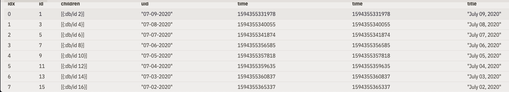
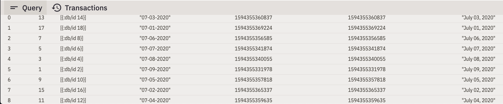

# ClojureFam - Week 3 - Day 4

Oh man I got sucked into that Daily notes issue. I basically spent the entire day trying to figure out what was causing the error.

I also just read the docs for `reagent`, DataScript and Posh.

## What I learned today

### Posh

- Lets you use a single DataScript database to store app state
- Reads from the DataScript db with `q` and `pull`
- Modify global state with `transact!`
- Works with multiple front-ends but most support with `reagent`

### DataScript

- Immutable, in-memory database and datalog query engine
- Has transaction reports - Can track the state of the app over time
- Rewind the app state
- In-component data queries only run when the database is updated with relevant data
- Uses a custom B+ Tree implementation internally
- Always contains datoms in 3 different indices (EAVT, AVET, AEVT)
- Mutate with `transact!`
- Directly look up a datom index using `datoms` or `seek-datoms`

### Reagent

- ClojureScript interface for React
- Uses Hiccup like markup instead of JSX.
- Hiccup represents HTML in Clojure with vectors representing elements and maps representing attributes

```clojure
[:div
    [:h3 "I am an example of Hiccup"]
    [:p "Am Yoda"
        {:style {:color "red"}}]]
```

- Manage state with an atom. When the value of this atom changes, any component that is deref'ing the atom gets automatically re-rendered.

## Athens Issue

Here's a link to the Daily Notes issue - It's long and there's a lot of stuff written about it on GitHub.

https://github.com/athensresearch/athens/issues/235

> Disclaimer: I wrote this when it was super late. It might not make much sense

I think the issue here is in the order that DataScript returns the results of a query rather than an issue with `daily-notes` since the `all_pages` table order also seems to be altered after 8 or so page creations.

The number 8 is interesting because the insertion order seems to be "preserved" until a 9th element is added which then changes the order. However, the DataScript indexes (eavt, avet, aevt) don't seem to change.

### Initial Debugging

Ostensible issue - something gone wrong in the daily-notes render function.

Where are daily-notes stored -> vector within the re-frame db `rfdb` called `daily-notes/items`.

In `daily_notes.cljs` ->

```clojure
(defn daily-notes-panel
  []
  (let [note-refs (subscribe [:daily-notes/items])]
    (fn []
      (when (empty? @note-refs)
        (dispatch [:daily-note/next (get-day)]))
      (let [eids (q '[:find [?e ...]
                      :in $ [?uid ...]
                      :where [?e :block/uid ?uid]]
                    db/dsdb
                    @note-refs)]
        (when (not-empty @eids)
          (let [notes (pull-many db/dsdb '[*] @eids)]
            [:div#daily-notes (use-style daily-notes-scroll-area-style)
             (doall
               (for [{:keys [block/uid]} @notes]
                 ^{:key uid}
                 [:<>
                  [:div (use-style daily-notes-page-style)
                   [node-page-component [:block/uid uid]]]]))
             [:div (use-style daily-notes-notional-page-style)
              [:h1 "Earlier"]]]))))))
```

`note-refs` subscribes to `:daily-notes/items`. Subscribe means that `note-refs` will only receive new data if `:daily-notes/items` changes.

Moving on to the DataScript query ->

```clojure
[eids (q '[:find [?e ...]
           :in $ [?uid ...]
           :where [?e :block/uid ?uid]]
          db/dsdb
          @note-refs)]
```

Here we get a vector of entity IDs who's `:block/uid` attribute matches the vector of note-refs (which is just a list of :daily-notes/items).

Now one reason, why the daily notes aren't rendering in the right order is maybe because the eids vector is not in the right order?

note-refs looks like -> `["07-08-2020", "07-07-2020", "07-06-2020",...]`. The order of this remains the same. No funky changes.

My next avenue of investigation was into how a new daily note was being created and if there was something wrong with that function.

Relevant function is the re-frame event handler - `:daily-note/next` : this function conjs a new uid to the `:daily-notes/items` vector.

To create a new daily note, there is a dispatch to `:page/create title uid` which is another reg-event-fx.

```clojure
(reg-event-fx
  :page/create
  (fn [_ [_ title uid]]
    (let [now (now-ts)
          child-uid (gen-block-uid)
          child {:db/id -2 :create/time now :edit/time now :block/uid child-uid :block/order 0 :block/open true :block/string ""}]
      {:transact! [{:db/id -1 :node/title title :block/uid uid :create/time now :edit/time now :block/children [child]}]
       :dispatch [:editing/uid child-uid]})))
```

This creates a transaction to add a new datom to the db. The transaction itself seems fine and doesn't have any obvious errors that leap out.

Issue probably lies in DataScript - [DataScript is good for storing unordered data](https://github.com/tonsky/datascript/wiki/Tips-&-tricks#preserving-order).

Internally DataScript uses a Custom B+ Tree Structure to hold the data. DataScript also maintains multiple indices to hold the datoms. The 3 indices are EAVT, AVET, AEVT.

It seems like there is no order guarantee for DataScript queries as far as I can see.

Now why does DataScript preserve order for some number of items? My hypothesis is that this is a function of the B+ Tree structure.



After a certain number of elements, (in this case 8), the tree rebalances it's buckets.



Solutions -

- Sort the result of the query
- Use the `datoms` function to query the DataScript indices directly for ordered data.

## Takeaways

Code can be complex sometimes. But I learned a lot about DataScript's internals by deep-diving into this issue.

Other than that and reading the documentation for reagent and posh, I also managed to submit a PR for fixing an incorrect date time format with the help of @nthd3gr33!

All in all a good day!
